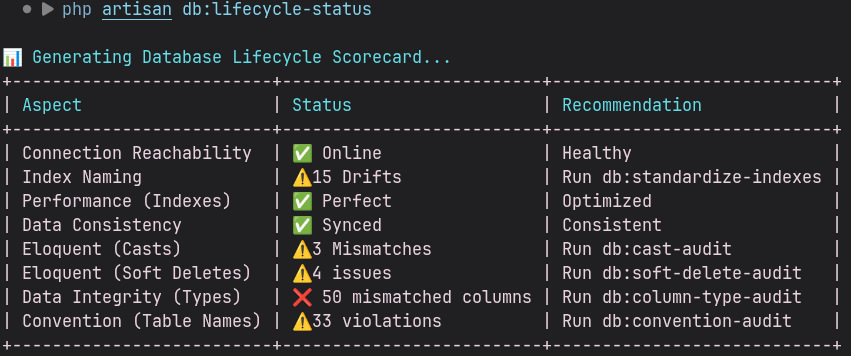
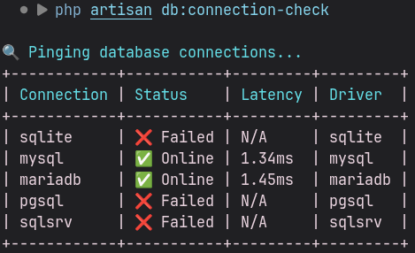
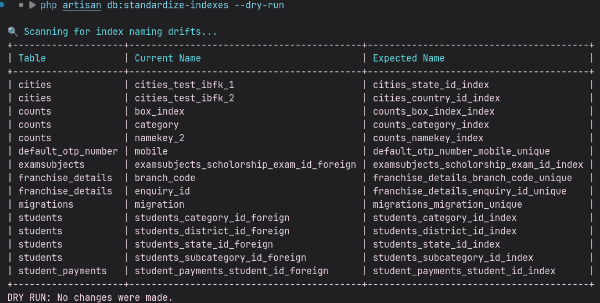

# Laravel Database Lifecycle Suite

[](https://github.com/ahtesham-clcbws/laravel-database-lifecycle-suite/releases)
[](https://packagist.org/packages/clcbws/laravel-database-lifecycle-suite)
[](https://github.com/ahtesham-clcbws/laravel-database-lifecycle-suite/blob/main/LICENSE.md)

**Laravel Database Lifecycle Suite** is a premium toolkit designed for database reverse-engineering, optimization, and visualization. It provides a comprehensive 360-degree view of your database health, from structural integrity to performance bottlenecks. Fully optimized for **Laravel 13.x**, with legacy support for 12.x and 11.x.

---

## 📸 Showcase

### Database Lifecycle Scorecard
Get a comprehensive health check of your database in one command.


### Connection Latency Monitoring
Verify reachability and measure performance across all your database nodes.


### Index Standardizer
Keep your index naming consistent across your entire application.


---

## ✨ Key Features

- 🌉 **Legacy Bridge**: Reverse-engineer an entire database into a clean Laravel project (Migrations, Models, Factories, Seeders).
- 📊 **Lifecycle Scorecard**: A quantifiable database health check covering performance, integrity, and connectivity.
- 📐 **Index Standardizer**: Automatically rename indexes to follow Laravel conventions.
- 🛡️ **Index Health Audit**: Detects unindexed Foreign Keys and **Potential Foreign Keys** (missing indexes on `_id` columns).
- 🔍 **Redundant Index Detector**: Identifies overlapping indexes that slow down write operations.
- 🔄 **Data Drift Deep Dive**: Compare data row-by-row across connections with interactive sync.
- 📸 **Schema Snapshotting**: Save schema states to JSON for offline comparison or time-travel restoration.
- 🎨 **ERD Visualizer**: Generate Mermaid.js Entity Relationship Diagrams directly from your schema.
- 🔒 **PII Scanner**: Identify potential security risks by scanning for sensitive data patterns.
- 📈 **Size & Growth Report**: Monitor disk usage and row counts across all tables.
- 🔬 **Query Explainer**: Get human-readable performance insights for any SQL query.
- 🧪 **Cast & Type Audit**: Detect discrepancies between Eloquent Model `$casts` and physical DB types.

---

## 📦 Installation

You can install the package via composer:

```bash
composer require clcbws/laravel-database-lifecycle-suite
```

> [!TIP]
> To enable **Structural Drift Detection** in the `db:lifecycle-status` report, we highly recommend also installing:
> `composer require clcbws/laravel-schema-sentinel`

Publish the configuration file:

```bash
php artisan vendor:publish --provider="Clcbws\DatabaseLifecycleSuite\DatabaseLifecycleSuiteServiceProvider" --tag="config"
```

---

## 🚀 Usage

### 1. Database Health & Auditing

#### Lifecycle Scorecard
To get a full overview of your database health:
```bash
php artisan db:lifecycle-status
```

#### Missing Index Audit
To identify unindexed Foreign Keys and potential performance bottlenecks:
```bash
php artisan db:index-audit
```

#### PII Scanning
To identify sensitive data columns (Email, Phone, etc.):
```bash
php artisan db:pii-scan
```

### 2. Optimization & Standardization

#### Standardize Index Names
To fix non-standard index names (includes `--dry-run` support):
```bash
php artisan db:standardize-indexes
```

#### Find Redundant Indexes
To find overlapping indexes that should be removed:
```bash
php artisan db:index-redundancy
```

### 3. Reverse Engineering & Visualization

#### Legacy Bridge
To reverse-engineer your database into a new Laravel project:
```bash
php artisan db:legacy-bridge
```

#### Generate ERD
To generate a Mermaid.js diagram of your database:
```bash
php artisan db:erd --output=schema.mmd
```

### 4. Snapshots & Data Integrity

#### Schema Snapshot
To save the current schema state:
```bash
php artisan db:snapshot baseline
```

#### Data Drift Check
To compare data records against a source connection:
```bash
php artisan db:data-drift --source=production --table=users
```

---

## 🏗️ Architecture

The suite is built with a modular "Auditor-Engine" architecture:
1. **Auditors**: Dedicated classes that analyze specific database traits (PII, Indexes, Casts).
2. **Engines**: Reusable core components for Snapshotting, Drift Detection, and Code Generation.
3. **Traits**: Standardized shared logic like `FiltersTables` for multi-database isolation.

---

## ⚙️ Versioning System

We follow [Semantic Versioning (SemVer)](https://semver.org/):
- **MAJOR (`1.x.x`)**: Breaking changes or significant architectural shifts.
- **MINOR (`x.1.x`)**: New features added in a backwards-compatible manner.
- **PATCH (`x.x.1`)**: Backwards-compatible bug fixes and small improvements.

---

## 📄 License

The MIT License (MIT). Please see [License File](LICENSE.md) for more information.

---

## 🤝 Credits

- **Author**: [Ahtesham](mailto:ahtesham@clcbws.com)
- **Company**: [Broadway Web Service](https://www.clcbws.com)

---
